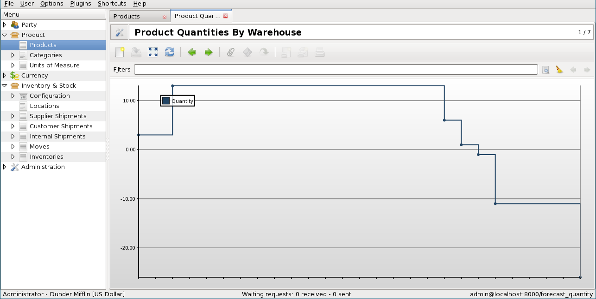

Nova versió de Tryton 2.6
#######################################################################################

:lang: ca
:slug: nove-versio-de-tryton-26
:date: 2012/10/23 12:00:00
:tags: release
:link: 
:description: 

Estem contents d'anunciar el llançament de la versió 2.6 de `Tryton
<http://www.tryton.org/>`_.

Aquesta versió porta canvis majors a la `API
<http://en.wikipedia.org/wiki/API>`_ amb la introducció del `patró Active
Record <http://en.wikipedia.org/wiki/Active_record>`_. La interfície gràfica no
ha estat oblidada i també ha rebut noves millores. Com de costum, s'han
corregit molts errors, s'han millorats alguns mòduls i s'han afegit nous mòduls
(com es va anunciar en les noticies de llançament de la última versió).

Per suposat, la migració de versions anteriors esta totalment suportada.

Majors canvis en la interfície gràcia d'usuari
----------------------------------------------

* Gestió de les regles d'accés als models i les regles per crear/esborrar el
  valor d'un camp.

  El client a partir d'ara es conscient de les regles d'accés al model. Això
  permet desactivar botons quan l'usuari no té els permisos suficients per
  accedir-hi.

  També es possible gestionar els esdeveniments de creació/eliminació als
  camps, a més a més dels esdeveniments de lectura/escriptura.
* Limit de mida dinàmic en els camps One2Many, Many2Many i Char.

  A partir d'ara es possible de limitar la mida d'aquest camps i el client
  s'encarrega de que aquests valors es compleixin.
* Eliminar la finestra emergent "Sis plau esperi". Aquesta finestra molestava
  perquè causava que el client perdes el focus.
* Enganxa en una vista de llista editable. Es possible empegar registres
  directament des d'un full de càlcul per modificar un conjunts de files.

Canvis majors a la banda del servidor
-------------------------------------

* Permetre utilitzar el camp Reference en les relacions One2ManyA i Many2Many.

  A més a més dels camps Many2One, el camp revers pot ser de tipus Reference.
  En el futur, l'enllaç entre els Moviments i els Enviaments s'implementarà
  d'aquesta forma, substituïnt els quatre camps Many2One exclusiu que hi ha
  actualment.
* Tots els tipus de botons s'han unit amb un concepte més simple.
* `Active Record <http://en.wikipedia.org/wiki/Active_record>`_: Aquest es el
  resultat de la refactorització que es va començar fa 2 anys.

  Us detallem alguns dels seus beneficis:

  * Reduir la quantitat de codi ( s'han eliminat unes 2.2k línies de codi). Per
    exemple on_change_with i la Funció getter s'uneixen.
  * Unificar l'accés al valor del registre independentment si esta guardat a la
    base de dades o no.Això permet eliminar valors del diccionari de valors al
    mètode on_change.
  * Eliminar el bucle sobre els ids en el getter d'un camp Function :

    *abans*::

        def getter(self, ids, name):
            res = {}
            for record in self.browse(ids):
                res[record.id] = …
            return res

    *després*::

        def getter(self, name):
            return self.…
  * Racionalitzar els proces de registre d'un Model (utilitzar copies dels
    camps, etc.)
  * Eliminar la sessió en els assistents. A partir d'ara la instància del
    Assistent és la sessió.

* Permetre guardar les vistes en fitxers XML en comptes de a la base de dades.
  Això ens permet la modificació de la vista sense actualitzar la base de
  dades. Una millorar en la velocitat de dissenyar vistes.
* S'ha afegit un nou tipus de validació: pre_validation.

  La nova validació pre_validation permet validar el registre sense guardar-lo.
  Aquesta validació es fa servir pel client per validar les línies dels camps
  One2Many. Amb la pre_validation es possible proporcionar informació als
  usuaris tan aviat possible i abans de que el registre estigui guardat.

Mòduls
------

account
~~~~~~~

* L'informe de balanç de sumes i saldos ara mostra el balanç inicial i el
  balanç final a més a més de les columnes de crèdit i dèbit.
* Es pot obrir el detall de la compte fent doble-click al balanç general.
* El pla de compte no acumula el Crèdit/Dèbit per defecte, només pel període actual.
* El balanç històric es calcula sobre tots els períodes fiscals.
* Els moviments comptables han estat refactoritzats per a incloure un camp
  origen, que permet enllaçar fàcilment al document mestre. Tenen dos camps de
  nombre per als Esborranys i els Confirmats.

account_stock_continental
~~~~~~~~~~~~~~~~~~~~~~~~~

* Actualitzar el preu de cost automàticament crea un moviment comptable de
  estoc.

purchase
~~~~~~~~

* El mòdul de compres pot gestionar quantitats negatives a les línies, generant
  Devolucions i notes de crèdit.

stock
~~~~~

* S'ha afegit un gràfic que mostra la evolució en el passat i en el futur del
  nivell de stock per un producte a un magatzem.

.. raw:: html

    

.. class:: img-rounded img-responsive

.. raw:: html

    

Nous mòduls
-----------

* `stock_lot` defineix lots de productes.
* `stock_split` afegeix un assistent per dividir un moviment.
* `account_fr` afegeix el pla comptable francès.
* `production` defineix els models bàsics per a la gestió de la producció.
* `stock_supply_production` afegeix mecanismes automàtics de subministraments
  basats en les sol·licituds de producció.

Altres canvis en la interfície gràfica d'usuari
-----------------------------------------------

* La interpolació constat s'ha afegit al gràfic de línia.
* Un grup pot tenir l'estat de només lectura.
* Es possible definir el format del temps i que aquest sigui diferent del
  clàssic '%H:%M:%S'.

Altres canvis en la banda del servidor
--------------------------------------

* S'ha eliminat la `ModelSQL.default_sequence`. Un camp de seqüència no
  s'incrementarà més de forma indefinida.
* El format del temps es valida, així es possible obligar que els segons siguin
  0 per exemple
* `__tryton__.py` es reemplaçat per `tryton.cfg`, un fitxer estàtic.
* Es possible utilitzar una  tuple com a valor d'una Reference.  És util per a
  construir dominis dinàmics en un camp en `PYSON`.
