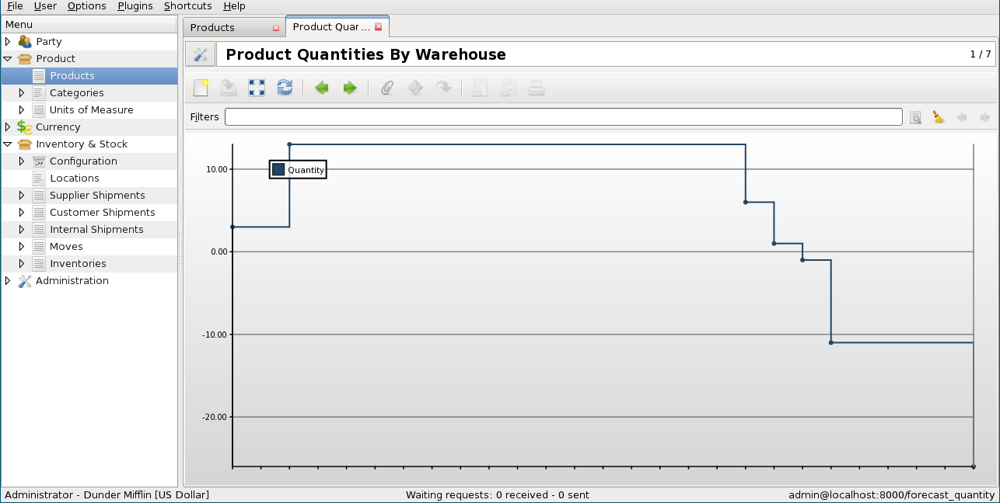

Nueva versión Tryton 2.6
#######################################################################################

:lang: es
:slug: nueva-version-tryton-26
:date: 2012/10/23 12:00:00
:tags: release
:link: 
:description: 

Estamos felices de anunciar la liberación de la nueva versión 2.6 de `Tryton
<http://www.tryton.org/es/>`_.

Hay importantes cambios en la `API
<http://es.wikipedia.org/wiki/Interfaz_de_programación_de_aplicaciones>`_, con
la introducción de la `Active Record pattern
<http://en.wikipedia.org/wiki/Active_record>`_. También hay que decir que no se
dejó sin mejoras la interfaz gráfica de usuario. Como siempre hay muchas
correcciones de bugs, mejoras de módulos y creación de nuevos módulos (como se
anunció en el comunicado anterior).

Por supuesto, la migración desde la versión anterior es totalmente compatible.

Cambios importantes en la interfaz gráfica de usuario
-----------------------------------------------------

* Gestión del modelo de acceso y campo de acceso crear/eliminar.

  El cliente ahora es consciente del modelo de acceso que permite desactivar
  los botones cuando el usuario no tiene acceso.

  También es posible gestionar el evento de crear/eliminar en campos
  adicionales a los de lectura/escritura.
* Límite de tamaño dinámico en la One2Many, Many2Many y Char.

  Ahora es posible limitar el tamaño de los campos y el cliente deberá
  forzarla.
* Se eliminó el box "Por favor espere". La pantalla emergente era molesta
  porque hacía perder la concentración al cliente.
* Pegar en la vista de lista editable. Es posible pegar desde una hoja de
  cálculo para actualizar un conjunto de filas.

Cambios importantes en el servidor
----------------------------------

* Permitir el uso del campo de Referencia en One2Many y Many2Many.

  Además de la Many2One, el campo inverso podría ser un campo de Referencia.
  En el futuro, la relación entre el Movimiento y Envíos se hará asñi como en
  lugar de tener 4 campos exclusivos Many2One.
* Los diferentes tipos de botones se han unificado en un simple concepto.
* `Active Record <http://en.wikipedia.org/wiki/Active_record>`_: Este es el
  resultado del trabajo de refactorización iniciado hace 2 años.

  Éstos son algunos de los beneficios:

  * Reducir la cantidad de código (eliminadas unas 2,2 k líneas) por ejemplo
    on_change_with y getter of Function field se pueden combinar.
  * Unificar el acceso al valor del registro si se almacena o no en la base de
    datos. Permite eliminar values dictionary on on_change method.
  * Eliminar loop over ids in getter of Function field:

    *antes*::

        def getter(self, ids, name):
            res = {}
            for record in self.browse(ids):
                res[record.id] = …
            return res

    *después*::

        def getter(self, name):
            return self.…
  * Justificación del proceso de registro de Modelo (usar copia de campos, etc)
  * Eliminar la sesión en el wizard. Ahora la instancia del wizard está en la sesión.

* Permite almacenar las vista en un archivo XML en lugar de la base de datos.
  Esto respalda la modificación de una vista sin actualizar la base de datos.
  Es una opción muy rápida para el diseño de vistas.
* Se ha añadido un nuevo tipo de validación a la pre_validación.

  El nuevo pre_validación permite validar un registro sin guardarlo. Esto es
  utilizado por el cliente para validar líneas de un One2Many. Con la
  pre_validación es posible proporcionar información al usuario tan pronto como
  sea posible y antes de que se guarde el registro.

Módulos
-------

account
~~~~~~~

* El informe Balance muestra ahora el inicio y el final del mismo, además de
  las columnas de débito y crédito.
* Al hacer doble clic en el Balance abre las cuentas.
* El Plan de Cuenta no muestra lo acumulado en débito/crédito por defecto, sólo
  para el período en curso.
* El Saldo Vencido se calcula sobre los años fiscales.
* Los Movimientos de Cuentas han sido rediseñados para incluir un campo de
  origen que permite vincularlos al documento maestro. Tienen dos campos de
  numero para borrador y publicado.

account_stock_continental
~~~~~~~~~~~~~~~~~~~~~~~~~

* La actualización de precio costo crea automáticamente un movimiento contable
  de stock.

purchase
~~~~~~~~

* La compra administra cantidades negativas en las líneas, generarán Devolución
  de Envíos y Nota de crédito.

stock
~~~~~

* Se ha agregado un gráfico que muestra la evolución en el pasado y en el
  futuro del nivel de existencias de un producto por almacén.

.. raw:: html

    

.. class:: img-rounded img-responsive

.. raw:: html

    

Nuevos módulos
--------------

* `stock_lot` define gran cantidad de productos.
* `stock_split` añade un wizard para dividir movimiento.
* `account_fr` añade Plan de Cuenta Francés.
* `production` define los conceptos básicos para la gestión de la producción.
* `stock_supply_production` añade mecanismos automáticos de suministro a través
  de solicitudes de producción.

Otros cambios en la interfaz gráfica de usuario
-----------------------------------------------

* Ha sido añadido una interpolación constante al gráfico de líneas.
* El grupo podría tener un estado de solo lectura.
* Es posible definir un formato de tiempo diferente del clásico '% H:% M:% S'.

Otros cambios en el servidor
----------------------------

* Se ha eliminado el `ModelSQL.default_sequence`. Los campos de secuencia no
  van a aumentar más indefinidamente.
* El formato de hora es validado, por lo que es posible, por ejemplo, forzar
  los segundos a 0.
* `__tryton__.py` se sustituye por `tryton.cfg`, un archivo estático.
* Es posible utilizar tuple como valor de referencia. Es útil para la
  construcción de dominio dinámico en campos en `PYSON`.
