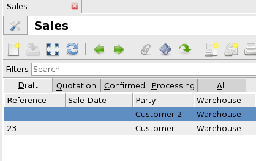
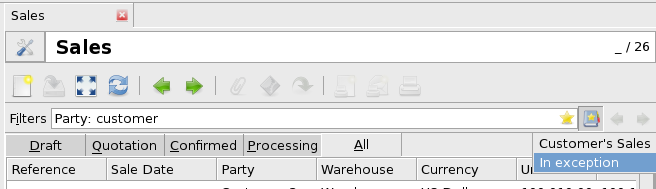
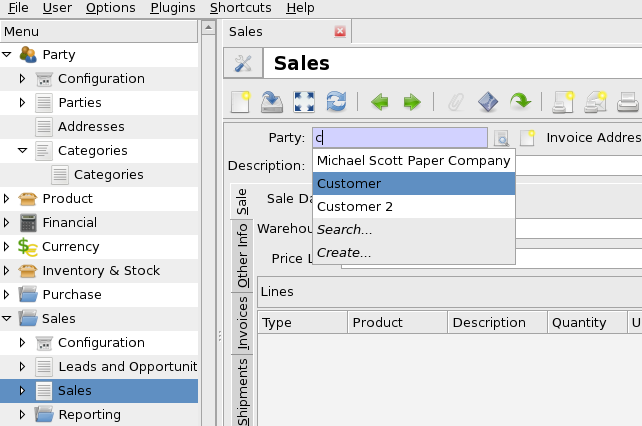
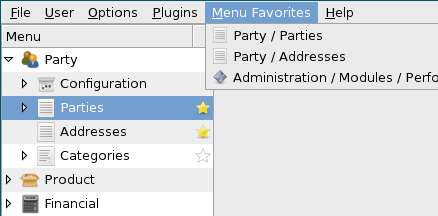
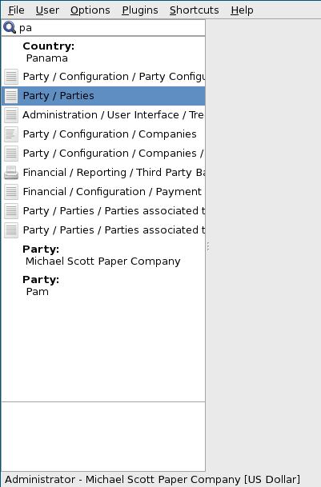
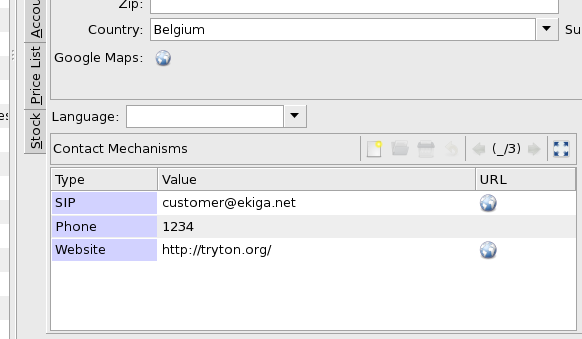
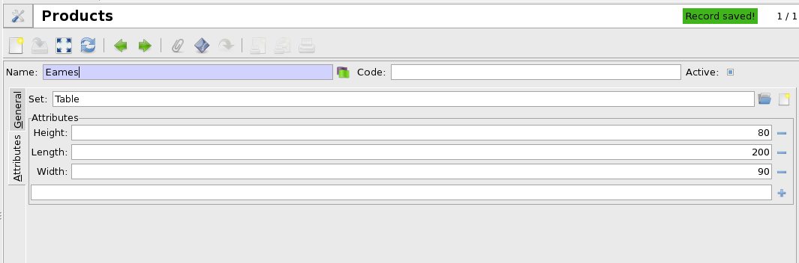

Nueva versión 2.8 de Tryton
#######################################################################################

:link: 
:description: 
:tags: release
:date: 2013/04/22 18:00:00
:lang: es
:slug: nueva-version-2.8-de-tryton

Nos complace anunciar la salida de la nueva versión 2.8 de  `Tryton
<http://www.tryton.org/>`_.

En esta versión se han realizado cambios en la interfaz del usuario para
mejorar el modo de trabajo de los usuarios. Los cambios más importantes son:
búsquedas favoritas (marcadores), autocompletado, búsqueda global y la revisión
de todos los mensajes de error, para proporcionar más información. Como es
habitual, también se han realizado correciones de errores, mejoras y nuevos
módulos (a continuación se dan más detalles).

Como es habitual, la migración desde las versiones anteriores esta
completamente soportada.

Cambios importantes en la interfaz del usuario
----------------------------------------------

* Añadido dominios en Acción de ventana:
  Esta funcionalidad permite mostrar pestañas en las vistas de lista. Estas
  pestañas permiten filtrar los registros. Todos los módulos han sido
  actualizados para aprovechar esta funcionalidad y por lo tanto se ha reducido
  el número de entradas del menú.

.. raw:: html

    

.. class:: img-rounded img-responsive

.. raw:: html

    

* Búsquedas favoritas:
  Los usuarios pueden guardar sus búsquedas favoritas y volver a ejecutarlas
  siempre que lo deseen.

.. raw:: html

    

.. class:: img-rounded img-responsive

.. raw:: html

    

* Autocompletado en campos relacionales (Many2One, Many2Many y One2Many):
  Cuando se escribe en alguno de estos campos el cliente trata de autocompletar
  para permitir una entrada rápida de los datos. El autocompletado también
  propone dos acciones adicionales: Crear un nuevo registro o entrar una
  búsqueda más compleja.

.. raw:: html

    

.. class:: img-rounded img-responsive

.. raw:: html

    

* Remplazo de los accesos directos por menú favoritos:
  Se han rediseñado los favoritos (también conocidos como accesos directos o
  atajos) para mejorar la experiencia del usuario.

.. raw:: html

    

.. class:: img-rounded img-responsive

.. raw:: html

    

* Añadida la búsqueda global:
  En la parte superior del menú se ha añadido una cuadro entrada que permite
  realizar búsquedas todos los documentos de la empresa y en las entradas de
  menú. Cuando se selecciona un resultado de la búsqueda, el cliente abre su
  vista de formulario o dará lugar a la acción de sus entradas de menú. El tipo
  de documentos a buscar es configurable.

.. raw:: html

    

.. class:: img-rounded

.. raw:: html

    

Cambios mayores en el servidor
------------------------------

* El método create ahora acepta una lista de valores, lo cual permite unificar
  la `API <http://en.wikipedia.org/wiki/API>`_. Esto mejora el rendimiento en
  la creación de un registro, validando todos los registros de golpe.
* Se sustituye (Campo, Operador, Operando) por reglas de dominio. Además de
  unificar la definición esto mejora la velocidad de cómputo y facilita la
  cache.
* Se ha introducido un nuevo tipo de campo `Dict`. Este campo permite almacenar
  un `diccionario`. Las llaves del mismo se guardan en la base de datos. El
  nuevo módulo  `product_attribute` utiliza esta funcionalidad (ver más abajo).
* Se ha decidio eliminar los _inherits porque no cumplían completamente con su
  cometido.  Se han remplazado sus usos (uno por uno) por campos `Function`,
  por clases de tipo `Mixin <http://en.wikipedia.org/wiki/Mixin>`_ o por un
  `Many2One`.
* Los valores de selección de un campo de tipo Referencia o Selección pueden
  ser dinámicos.  Esto se produce gracias al atributo `selection_change_with`.

Módulos
-------

account
~~~~~~~

* La secuencia del apunte es opcional en el período. Si no se indica se
  utilizará la secuencia del ejercicio fiscal.
* Las reglas de impuestos y los grupos de impuestos tienen un atributo tipo
  (`ventas`, `compras` o `otros`) que se utiliza para definir dónde se pueden
  utilizar.

account_invoice
~~~~~~~~~~~~~~~

* Las secuencias de facturación del período también son opcionales.
* Cuando se cancela una factura el apunte existente se eliminará si es posible.
  Si no se puede eliminar se cancelará mediante el apunte contrario.
* Cuando se valida la factura de proveedor se crea el apunte en borrador.  En
  caso de que la validación en dos fases esto permite obtener informes
  actualizados.
* Las facturas de proveedor y los abonos de proveedor no se pueden rembolsados
  de forma automática porque se deben revisar con el abono del proveedor.

dashboard
~~~~~~~~~

* Para facilitar al usuario la selección de acciones en el escritorio estas se
  filtran en función del uso del `escritorio`.

party
~~~~~

* Se utiliza el widget de url en las vistas de lista para el método de
  contacto.

.. raw:: html

    

.. class:: img-rounded img-responsive

.. raw:: html

    

purchase
~~~~~~~~

* A partir de ahora es posible dejar el tiempo de entrega vacío para un
  producto de proveedor. Eso significa que no sabemos cuándo se va a entregar.

stock
~~~~~

* Con el nuevo diseño del flujo de trabajo ya no hay más cuellos de botella al
  añadir un nuevo movimiento de stock.
* Todas las relaciones Many2One de los envíos se han simplificado en una sola
  Referencia al envío.

stock_supply
~~~~~~~~~~~~

* El método `find_best_supplier` ya no optimiza el retraso de la entrega para
  respetar el orden de prioridad al seleccionar un proveedor.

timesheet
~~~~~~~~~

* A partir de ahora es posible definir un período que indicará el tiempo en que
  un trabajo estará disponible para entrar las hojas de trabajo.

Nuevos módulos
--------------

* `account_asset` añade la opción de la depreciación fija de activos.
* `sale_supply` añade la opción `enviar a la venta` al producto para generar
  pedidos de compra desde las líneas de venta independientemente de los niveles
  de existencias.
* `sale_supply_drop_shipment` añade la opción `envío directo` al producto si se
  ha marcado la opción `enviar a la venta` para generar un envío directo.
* `project_invoice` añade métodos de facturación (`Manual`, `Por el esfuerzo
  estimado`, `Por las horas realizadas`) a los proyectos.
* `product_attribute` añade atributos de producto flexibles.

.. raw:: html

    

.. class:: img-rounded img-responsive

.. raw:: html

    

Otros cambios en la interfaz de usuario
---------------------------------------

* Se puede utilizar un rango de Fechas/Horas en la búsqueda de registros.
* Se permite la multiselección para campos de tipo Selección en la búsqueda de
  registros.
* La vista de lista ahora puede mostrar url's.
* El menú plugins se ha movido a la barra de herramientas acciones.

Otros cambios en el servidor
----------------------------

* El idioma por defecto se guarda en la base de datos, cosa que soluciona
  errores inesperados en caso de que la configuración del servidor se cambie.
* Se ha eliminado la restricción única en las reglas de acceso del modelo y del
  campo para permitir que diferentes módulos creen accesos que se superpongan.
* La lista de _constraints se ha declarado obsoleta y se ha reemplazo por el
  método `validate` para mejorar los mensajes de error.
* Ahora se puede buscar sobre el resultado de los campos de referencia.
