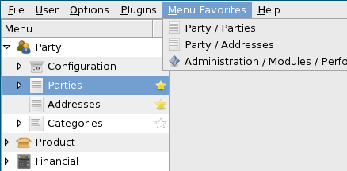
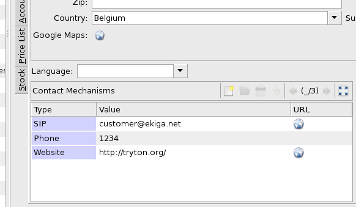

New Tryton release 2.8
#######################################################################################

:link: 
:description: 
:tags: release
:date: 2013/04/22 18:00:00
:lang: en
:slug: new-tryton-release-28

We are happy to announce the 2.8 release of `Tryton <http://www.tryton.org/>`_.

This release brings many changes for the graphical user interface in order to
improve the workflow of the users like bookmarks, auto-completion, global
search and a review of all error messages to provide more information.  As
usual there are many bug-fixes, module improvements and new modules (see
below).

Of course, migration from previous series is fully supported.

Major changes in graphical user interface
-----------------------------------------

* Add domains on Action Window:
  This feature allows to set above any list view tabs which filter the records.
  All modules have been updated to take advantage of it and thus it reduced the
  number of menu entries.

.. raw:: html

    

.. class:: img-rounded img-responsive
.. image:: ../images/news/tryton_act_window_domain.png
    :alt: Action Window domain

.. raw:: html

    

* Bookmarks for search:
  Users can now bookmark their own searches and recall them anytime.

.. raw:: html

    

.. class:: img-rounded img-responsive
.. image:: ../images/news/tryton_bookmark.png
    :alt: Bookmark

.. raw:: html

    

* Auto-completion on Many2One, Many2Many and One2Many:
  When typing in those fields, the client will try to auto-complete them to
  allow a fast encoding. The completion also proposes two more actions to
  create a new record and to enter a complex search.

.. raw:: html

    

.. class:: img-rounded img-responsive
.. image:: ../images/news/tryton_completion.png
    :alt: Completion

.. raw:: html

    

* Replace shortcuts by menu favorites:
  A new design for favorites aka shortcuts has been implemented for a better
  user experience.

.. raw:: html

    

.. class:: img-rounded img-responsive

.. raw:: html

    

* Add global search:
  A quick entry box has been added on top of the menu. It allows to search over
  all the business documents and the menu entries for fast access. When a
  search result is selected, the client will open its form view or will trigger
  the action for menu entries. The kind of documents to search is configurable.

.. raw:: html

    

.. class:: img-rounded img-responsive
.. image:: ../images/news/tryton_global_search.png
    :alt: Global Search

.. raw:: html

    

Major changes on the server side
--------------------------------

* The create method takes now a list of values thus unifying the `API
  <http://en.wikipedia.org/wiki/API>`_. This also improves the creation
  performance by validating in a bunch the created records.
* (Field, Operator, Operand) are replaced by Domain on Rule in addition to
  unify such definition, it speeds up the computation and eases caching.
* A new kind of field `Dict` is introduced. This field allows to store a
  `dictionary` for which the definitions of the keys are stored in the
  database. This feature is used in the new module `product_attribute` (see
  below).
* It was decided to remove _inherits because it doesn't fulfill its mission. It
  was replaced case by case by `Function` fields, by a `Mixin
  <http://en.wikipedia.org/wiki/Mixin>`_ class or simply by an explicit
  `Many2One`.
* The selection values of Selection and Reference fields can now be dynamic
  thanks to the `selection_change_with` attribute.

Modules
-------

account
~~~~~~~

* The Move Sequence on Period is optional. So if it is empty the fiscal year's
  one will be used.
* Tax Rule and Tax Group have `sale`, `purchase` or `other` kind attribute
  which allow to define where they can be used.

account_invoice
~~~~~~~~~~~~~~~

* Invoice Sequences on Period are also optional.
* When cancelling an Invoice, the existing move will be deleted if possible or
  cancelled with an opposite move.
* On validate Supplier Invoice, the draft Move is created. This allows in case
  of two step validation to get reports already up to date.
* Supplier Invoice and Credit Note can no longer be refunded automatically
  because they must be checked with the supplier one.

dashboard
~~~~~~~~~

* To ease user to select the actions for the dashboard, they are filtered based
  on the usage `dashboard`.

party
~~~~~

* The new url widget on list view is used for contact mechanisms.

.. raw:: html

    

.. class:: img-rounded img-responsive

.. raw:: html

    

purchase
~~~~~~~~

* It is now possible to let the delivery time empty for a product supplier.
  This means that we don't know when the supplier will deliver.

stock
~~~~~

* With the new workflow design, it was no more a bottleneck to add it on stock
  move.
* All shipment Many2One on Move have been merged into one single shipment
  Reference.

stock_supply
~~~~~~~~~~~~

* The method `find_best_supplier` doesn't optimize anymore on the delivery
  delay and so it fully respects the priority order to select a supplier.

timesheet
~~~~~~~~~

* It is now possible to define a period on which a work can be used to fill a
  timesheet.

New modules
-----------

* `account_asset` adds depreciation of fixed assets.
* `sale_supply` adds a `supply on sale` option on product to generate purchase
  request from sale lines regardless of the stock levels.
* `sale_supply_drop_shipment` adds a `drop shipment` option on product supplier
  if `supply on sale` is checked to generate a drop shipment.
* `project_invoice` adds some invoice methods (`Manual`, `On Effort`,
  `On Timesheet`) on project.
* `product_attribute` adds flexible attributes on product.

.. raw:: html

    

.. class:: img-rounded img-responsive
.. image:: ../images/news/tryton_product_attribute.png
    :alt: Product Attribute

.. raw:: html

    

Other changes in graphical user interface
-----------------------------------------

* It is possible to use a range for Date/Time fields in filter box.
* Multi-selection for Selection field is allowed in filter box.
* View list can now disply url's.
* The Plugins menu is moved into the toolbar Actions.

Other changes on server side
----------------------------

* The default language is stored in the database which prevents unexpected
  behaviors in case the configuration of the server is changed.
* The unique constraint on model and field access has been removed to allow
  many modules create their own accesses that overlap.
* The _constraints list is deprecated and is replaced by the `validate` method
  on ModelStorage to allow better error messages.
* Now it is possible to search on the target of a Reference field.
