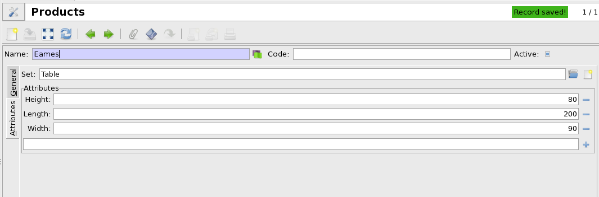

Novedades de desarrollo
#######################################################################################

:lang: es
:slug: novedades-de-desarrollo
:date: 2013/02/18 12:00:00
:tags: desarrollo
:link: 
:description: 

A continuación se muestran algunos cambios recientes en la rama de desarrollo
que serán incorporados en la siguiente versión.

Servidor
--------

* El idioma por defecto de la base de datos tiene preferencia respeto al idioma del
  fichero de configuración. Esto le permite crear múltiples bases de datos con
  diferentes idiomas.
* El ``(Campo, Operador, Operante)`` en las reglas de acceso se han reemplazado
  por texto plano en el dominio. Este cambio comporta más rapidez (30%) en los tests.
* La API_ del ``ModelStorage.create`` ha cambiado para ser utilizado una lista de
  valores. Esto le permite crear muchos registros a la vez en una sola llamada.
* Un nuevo campo del tipo ``diccionario``. Este campo le permite guardar un ``diccionario``
  en la base de datos.
* El atributo ``selection_change_with`` esta disponible en los campos ``Selección``
  y ``Relacionats``. Se comporta como``on_change_with`` pero modifica la lista de
  valores. El sistema de validación también tiene presente estos nuevos atributos.

.. _API: http://en.wikipedia.org/wiki/API

Cliente
-------

* El nuevo buscador le permite:

  * multi-selección de valores en los campos ``Selección``

    .. class:: img-rounded img-responsive
    .. image:: ../images/news/tryton_multi_selection_filter.png
        :alt: multi-selection filter

  * rango en los campos ``Fecha`` y ``Fecha/Hora``

    .. class:: img-rounded img-responsive
    .. image:: ../images/news/tryton_range_date_filter.png
        :alt: range date filter

* Reducir el número de entradas de menú, un nuevo concepto introducido a:
  El `dominio por tabulación`. Le permite definir un conjunto de pestañas que son filtradas por dominio.
  Le permite pasar de una pestaña a otra y los registros se refrescan según la información solicitada.
  Todos los módulos se han actualizado para disponer de esta funcionalidad.

    .. class:: img-rounded img-responsive
    .. image:: ../images/news/tryton_domain_tab.png
        :alt: domain tab

* Los usuarios pueden añadir favoritos en sus búsquedas.

    .. class:: img-rounded img-responsive
    .. image:: ../images/news/tryton_search_bookmark.png
        :alt: search bookmark

* El icono de la ``URL`` puede ser dinámico.
* El icono de la ``URL`` también esta disponible en la vista de listado.
* El menú favoritos remplaza por un menú corto.

    .. class:: img-rounded img-responsive
    .. image:: ../images/news/tryton_menu_favorites.png
        :alt: menu favorites

* Disponible una búsqueda global. Se puede buscar dentro de todos los registros disponibles.

    .. class:: img-rounded img-responsive
    .. image:: ../images/news/tryton_global_search.png
        :alt: global search

Módulos
-------

Account Asset
~~~~~~~~~~~~~

Es un nuevo modulo para la gestión de pagos.
Por ahora se calcula sólo con el calculo “lineal“ pero se pueden añadir más sistemas de cálculo.

Account
~~~~~~~

* Se ha añadido el campo ``tipo`` en el `grupo de impuestos` y `Reglas de impuestos` con las opciones:
  `Ventas`, `Compras` o `Ambos`. Cada cuenta contable se puede utilizar la selección de los impuestos.

Account Invoice
~~~~~~~~~~~~~~~

* El flujo de trabajo de la `factura` se ha revisado.

  * En el estado de Cancelado, el `movimiento` es eliminado o cancelado.
  * Los `movimientos` en borrador de la `Factura de proveedor` es creado en la validación.
  * El estado de Proforma es renombrado por Validado para ser más genérico.
  * El estado Abierto es renombrado `Emitida` para ser más coherente con la resta del software.

Stock
~~~~~

* El flujo de trabajo se ha añadido `Movimientos de stock`.

Product Attribute
~~~~~~~~~~~~~~~~~

Un nuevo modulo para gestionar grupos de atributos en los `Productos` utilizando un nuevo campo `Diccionario``.

.. class:: img-rounded img-responsive

